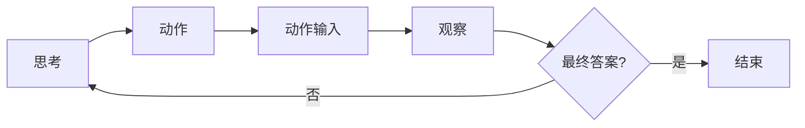
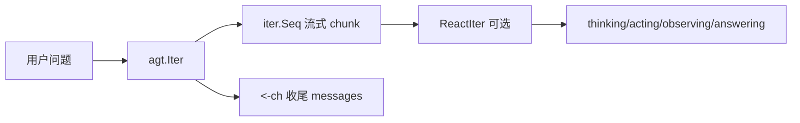

# eastLaugh's dead simple ReAct Agent

一个极简的 ReAct（Reasoning + Acting）Agent 框架：用 Go 迭代器做流式输出，工具即普通函数，几行代码就能跑起来。

## 功能

- **ReAct 流程**：模型按「思考 → 动作 → 动作输入 → 观察」循环，直到给出「最终答案」。
- **工具即函数**：任意 `func(...) (string|int|...)` 配上描述即可注册为工具，参数通过 `fmt.Sscan` 从模型输出的「动作输入」解析。
- **流式迭代**：`Iter(messages, question)` 返回 `(iter.Seq[string], <-chan []openai.Message)`，边推理边产出文本；`ReactIter` 把纯文本流打成「thinking / acting / observing / answering」状态，前端或 CLI 可直接按状态展示。
- **兼容 OpenAI API**：通过 `OPENAI_BASE_URL` 接任意兼容接口（含 DeepSeek、本地模型等）。

### ReAct 单轮流程

模型在一轮中可能多次「思考 → 动作 → 观察」，直到输出「最终答案」为止。



### 调用流（Iter + 流式）



## 如何使用

### 环境

复制 `.env.example` 为 `.env`，填好：

```bash
OPENAI_API_KEY=sk-xxx
OPENAI_BASE_URL=https://api.openai.com/v1   # 或其它兼容地址
OPENAI_MODEL=gpt-4o                        # 可选，按需
```

### Examples

| 命令 | 说明 |
|------|------|
| `go run ./cmd/chat` | 终端多轮对话，纯文本流，无状态区分 |
| `go run ./cmd/iter` | 终端多轮对话，带 ReAct 状态着色（思考/动作/观察/答案） |
| `go run ./cmd/server` | HTTP 服务：`POST /api/conversations` 建会话，`POST /api/chat` 流式对话，`GET /api/conversations/:id` 拉消息 |

### 写一个 Agent

```go
client := openai.NewClient(
    os.Getenv("OPENAI_BASE_URL"),
    os.Getenv("OPENAI_API_KEY"),
    os.Getenv("OPENAI_MODEL"),
)

agt := agents.New(client, nil,
    getTime,   "返回当前系统时间（RFC1123）。",
    add,       "计算两整数之和。参数：a, b（空格分隔）。",
    tools.HttpGet, "发送 HTTP GET 请求。",
    rand.IntN, ""
)

// 一轮对话：流式消费 + 收尾消息
iter, ch := agt.Iter(messages, question)
for chunk := range iter {
    fmt.Print(chunk)
}
messages = <-ch
```

工具以 **函数 + 描述字符串** 成对传入，描述会写进 system prompt，模型按「动作：函数名」「动作输入：参数」调用。

## 优点

- **极简**：核心就是 `agents.New` + `Iter`，无 DSL、无 YAML，工具就是普通 Go 函数。
- **流式友好**：用 Go 1.22+ 的 `iter.Seq`，边推边打，不攒整段再输出；`ReactIter` 把流打成状态，前端/CLI 不用自己解析「思考」「最终答案」。
- **单一数据源**：对话历史由调用方维护（或交给 server 内存），`Iter` 只消费 `messages`、产出流和收尾的 `<-ch`，不藏状态。
- **易扩展**：新工具 = 新函数 + 一句描述，无需改框架；如需自定义 system prompt，传 `prompter func(string) string` 即可。

## 项目结构

```
cmd/chat     # 纯流式 CLI
cmd/iter     # 带 ReAct 状态着色的 CLI
cmd/server   # HTTP API + 内存会话
pkg/agents   # ReAct Agent + ReactIter
pkg/openai   # 流式 OpenAI 兼容客户端
pkg/tools    # 内置工具（HttpGet、SearchInternet 等）
pkg/util     # 反射工具（工具参数解析）
web/         # 示例前端
```